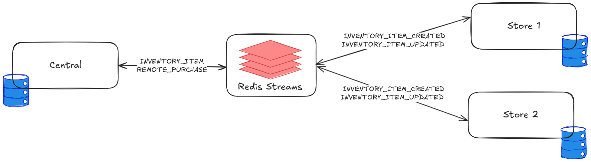

# Distributed Inventory Prototype - MeLi Take‑Home Challenge

## Overview

Event‑driven distributed inventory system prototype with one Central and multiple Stores, using Redis Streams as broker.

The solution achieves latency in the order of seconds and favors (eventual) consistency over availability for remote purchases.

## Running the Project

You can run Redis, Central server, and two Store servers with the provided Docker Compose.

### Requirements

- Java 21
- Docker
- Docker Compose

### Steps

1. Build the project

   ```bash
   ./mvnw clean package
   ```

2. Start services

   ```bash
   docker compose up -d
   ```

3. Access services

   - Central → `localhost:8081`
   - Store 1 → `localhost:8082`
   - Store 2 → `localhost:8083`
   - Redis → `localhost:6379`

4. Stop services
   ```bash
   docker compose down
   ```

### Demo

You can find an example demo exercising the different features of the system in `demo.http`.

It includes a sequence of requests that showcases the main flows, along with the expected results.

It also functions as an integration test that can be run using IntelliJ's HTTP Client.

---

## Architecture

The project is a multi-module Spring application with two main modules, one for central and another for stores.

### Technology Stack

- Java 21, Spring Boot 3 (Web, Validation, Actuator, Scheduling)
- JPA/Hibernate with in‑memory H2 for persistence. Both JPA and H2 were selected for speed of development.
- Redis and Redis Streams for messaging and heartbeats

### Modules

- **store-server**: REST API for the stores.
- **central-server**: REST API for the central.
- **model**: Common domain models for the whole project.
- **repository**: Common repositories for the whole project. Uses JPA repositories for development speed.
- **messaging**: Redis Streams broker configuration and setup.

### System Diagram

<div align="center">
  
  <br/>
  <sub>Simplified view with 1 Central, Redis Streams, and 2 Stores. Lines show event types.</sub>
</div>

### Flow Explanation

- Online sale request (remote purchase):

  1. Central receives the request and checks the store is online; if offline, it rejects the purchase.
  2. If online, Central updates global stock transactionally and emits the `INVENTORY_ITEM_REMOTE_PURCHASE` event to corresponding store.
  3. The Store consumes the event and applies the delta to its local DB.

- Store stock change (create/update or local sale):
  1. Store updates its local DB transactionally.
  2. Store emits `INVENTORY_ITEM_CREATED` or `INVENTORY_ITEM_UPDATED` event to central.
  3. Central consumes the event and updates its global view.

### Broker Selection - Redis Streams

- Easy local setup in Docker, suitable for prototypes.
- Consumer groups and acknowledgments for at‑least‑once semantics.
- Stream IDs and per‑event ids support idempotency patterns.
- Other options: Kafka, RabbitMQ.

### Consistency vs Availability

Favor consistency for central‑initiated purchases to avoid overselling.

Each store signals it's online by storing a heartbeat in Redis every 30 seconds.
Central rejects remote purchases when the target store hasn't updated their heartbeat for the last 50 seconds, and it's considered disconnected.

### Fault Tolerance

#### Store Disconnection Detection

Central detects store disconnection by checking the heartbeat timestamp.

#### Outbox Event Publishing

To avoid dropping events when redis is not accessible (disconnected, or Redis is down), an outbox pattern is used.
To publish an event, you first perist it to an `outbox_event` table, then a separate worker is responsible for publishing to Redis unpublished events present in the outbox table.
For the prototype, the publisher is implemented with a scheduled polling worker.

#### Idempotency

To avoid processing events multiple times, every event is generated with an UUID which is stored in redis after being processed.
Before processing an event, we first check atomically if that UUID was already processed, dropping it if that is the case.

#### Offline Recovery

During disconnection, events remain in the outbox and are published once connectivity is restored.
Central rejects remote purchases for offline stores, but stores can still apply local changes.

---

## API Design

### Central Server

- `GET /` — health check
- `GET /inventory?page={0..}&size={1..1000}` — list items (paginated)
- `GET /inventory/{storeId}/{productId}` — fetch one item
- `POST /purchase/{storeId}/{productId}` body: `{ "quantity": number>0 }` — remote purchase

### Store Server

- `GET /` — health check
- `POST /connected` — simulate connectivity OK (enables heartbeats and outbox publishing)
- `POST /disconnected` — simulate disconnection (stops heartbeats and outbox publishing)
- `GET /inventory?page={0..}&size={1..1000}` — list items
- `GET /inventory/{productId}` — fetch one item
- `POST /inventory` body: `{ "productId": string }` — create item (quantity starts at 0)
- `PUT /inventory/{productId}` body: `{ "quantity": number>=1 }` — set quantity
- `POST /purchase/{productId}` body: `{ "quantity": number>=1 }` — local purchase

---

## Next Steps

- Authentication/authorization for APIs
- DB authentication and secure connections (Redis & H2)
- Migrate to a real SQL DB such as PostgresSQL
- Request tracing over events
- Measure key metrics on the status of the system

### Observability

#### Metrics to track

- Heartbeat freshness per store
- Outbox size and age of oldest unpublished event
- Event publish/consume throughput and lag per stream and consumer group
- Purchase success/failure counts and reasons (e.g., store unavailable, insufficient stock)
- Inventory mutation counts (create, update, remote purchase)
- Redis stream size and age of oldest unprocessed event

#### Tracing

- Propagate a request/event correlation id across REST and events to trace end‑to‑end flows.
- Configure OpenTelemetry or a similar service to capture metrics and traces.

## AI Usage

Both Cursor and Claude Code were used to evaluate designs and implement them.
Also, cursor's tab model is the best right now.

My methodology is to avoid the autocompaction of the agents.
I decide when performance is degrading, to stop the agent and restart it.
To avoid losing too much context, I always ask them at the end of each session to dump their current context into .md files inside .memory/.
I've included some of them as examples.
